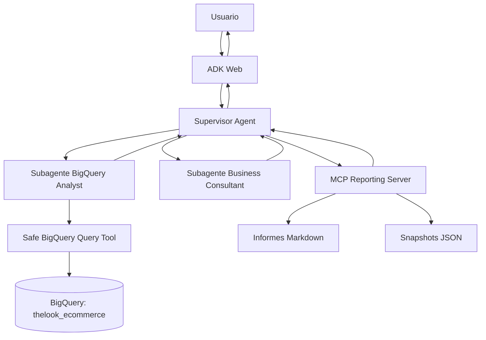

# EcomInsight Agent  
## Copiloto multiagente para análisis de e-commerce con BigQuery


---

## 1. Resumen del proyecto

**EcomInsight Agent** es un sistema multiagente orientado al análisis de datos de e-commerce mediante lenguaje natural. El objetivo es permitir que un usuario de negocio pueda realizar preguntas sobre ventas, clientes, productos, pedidos y oportunidades comerciales sin necesidad de escribir SQL directamente.

El sistema utiliza un **agente supervisor**, dos **subagentes especializados**, una fuente de datos fundamentada en **BigQuery** y un **servidor MCP propio** para generar informes y guardar evidencias del análisis.

El proyecto está pensado para cumplir los requisitos del trabajo final: construir un sistema multiagente funcional, con herramientas MCP y grounding sobre una fuente de datos real.

---

## 2. Problema que resuelve

En muchos entornos de e-commerce, los datos están disponibles en almacenes analíticos como BigQuery, pero no todos los perfiles de negocio tienen conocimientos suficientes para consultar la información con SQL.

Este proyecto busca resolver ese problema mediante un asistente conversacional capaz de:

- Responder preguntas de negocio sobre datos reales.
- Consultar BigQuery de forma segura.
- Interpretar resultados desde una perspectiva comercial.
- Generar informes ejecutivos en Markdown.
- Guardar snapshots del análisis para trazabilidad.
- Gestionar de forma controlada preguntas fuera de alcance o consultas peligrosas.

---

## 3. Objetivos del sistema

Los objetivos principales del sistema son:

1. Permitir consultas en lenguaje natural sobre un dataset de e-commerce.
2. Traducir preguntas de negocio en consultas analíticas seguras.
3. Ejecutar únicamente consultas de lectura sobre BigQuery.
4. Interpretar los resultados con lenguaje comprensible para negocio.
5. Generar informes reutilizables mediante una herramienta MCP.
6. Demostrar una arquitectura multiagente con supervisor y subagentes.
7. Documentar limitaciones, costes, modos de fallo y posibles mejoras.

---

## 4. Escenario de uso

El usuario objetivo sería un perfil de negocio, analista comercial, responsable de marketing o responsable de e-commerce que quiere analizar el comportamiento de la tienda online.

Ejemplos de preguntas:

- ¿Qué categorías generan más ingresos?
- ¿Cuáles son los productos más vendidos?
- ¿Qué países tienen mayor volumen de ventas?
- ¿Qué porcentaje de pedidos se cancela?
- ¿Qué segmentos de clientes parecen más rentables?
- ¿Dónde invertirías más presupuesto de marketing?
- Genera un informe ejecutivo con los principales hallazgos.
- Guarda este análisis para revisarlo posteriormente.

---

## 5. Arquitectura general

El sistema se compone de los siguientes elementos:

1. **Usuario**
2. **ADK Web**
3. **Supervisor Agent**
4. **BigQuery Analyst Agent**
5. **Business Consultant Agent**
6. **Safe BigQuery Tool**
7. **BigQuery Dataset**
8. **MCP Reporting Server**
9. **Informes Markdown y snapshots JSON**

### Diagrama conceptual



---

## 7. Componentes del sistema

---

## 7.1 Supervisor Agent

El **Supervisor Agent** es el punto de entrada principal del sistema. Recibe la consulta del usuario y decide qué componente debe intervenir.

### Responsabilidades

- Interpretar la intención del usuario.
- Decidir si la consulta requiere datos de BigQuery.
- Delegar el análisis técnico al subagente BigQuery.
- Delegar la interpretación al subagente de negocio.
- Invocar el servidor MCP cuando el usuario solicita un informe o snapshot.
- Gestionar errores y consultas fuera de alcance.
- Devolver una respuesta final clara y estructurada.
---

## 7.2 BigQuery Analyst Agent

El **BigQuery Analyst Agent** es el subagente especializado en obtención de datos.

### Responsabilidades

- Convertir preguntas de negocio en consultas SQL.
- Usar únicamente tablas permitidas.
- Ejecutar consultas mediante la herramienta segura de BigQuery.
- Devolver resultados estructurados.
- Informar de errores SQL o datos insuficientes.
- Evitar operaciones de escritura o modificación de datos.

### Consultas soportadas inicialmente

Para reducir complejidad y aumentar fiabilidad, la primera versión del sistema puede limitarse a consultas analíticas concretas:

1. Ingresos por categoría.
2. Top productos por ingresos.
3. Ventas por país.
4. Estado de pedidos.
5. Evolución mensual de ventas.
6. Clientes por país.
7. Ticket medio por país o categoría.

---

## 7.3 Business Consultant Agent

El **Business Consultant Agent** interpreta los resultados obtenidos por el subagente de datos.

### Responsabilidades

- Traducir datos en conclusiones de negocio.
- Identificar oportunidades comerciales.
- Detectar riesgos o anomalías.
- Proponer recomendaciones accionables.
- Explicar limitaciones del análisis.
- Preparar resúmenes para dirección.
---

## 7.4 Safe BigQuery Tool

La **Safe BigQuery Tool** es la capa técnica que ejecuta las consultas contra BigQuery.

### Responsabilidades

- Conectarse a BigQuery usando `google-cloud-bigquery`.
- Ejecutar consultas de solo lectura.
- Bloquear sentencias peligrosas.
- Añadir límites de filas.
- Configurar un máximo de bytes facturables.
- Devolver los resultados en formato estructurado.

### Validaciones de seguridad

La herramienta debe rechazar consultas que contengan operaciones como:

- `INSERT`
- `UPDATE`
- `DELETE`
- `DROP`
- `TRUNCATE`
- `MERGE`
- `ALTER`
- `CREATE`
- `EXPORT`
- `CALL`

También debe comprobar que la consulta empieza por `SELECT` o `WITH`.

---

## 7.5 BigQuery como fuente fundamentada

La fuente de datos principal será BigQuery.

### Dataset 

```text
bigquery-public-data.thelook_ecommerce
```

Este dataset público contiene información realista de un e-commerce, incluyendo:

- usuarios;
- pedidos;
- productos;
- inventario;
- eventos;
- categorías;
- marcas;
- países;
- fechas;
- estados de pedido.

### Tablas principales

| Tabla | Uso previsto |
|---|---|
| `orders` | Análisis de pedidos, estados, fechas y usuarios |
| `order_items` | Cálculo de ingresos y productos vendidos |
| `products` | Categorías, marcas, departamentos y precios |
| `users` | Segmentación por país, edad, género o localización |
| `events` | Análisis de comportamiento web, si se incluye en una fase avanzada |

---

## 7.6 MCP Reporting Server

El **MCP Reporting Server** es el servidor MCP propio del proyecto. Su función principal es permitir que el sistema genere artefactos persistentes.

Mientras que los subagentes razonan y analizan, el MCP ejecuta acciones concretas fuera del modelo.

### Función del MCP en el sistema

El MCP permite:

- Crear informes ejecutivos en Markdown.
- Guardar snapshots del análisis en JSON.
- Registrar la pregunta del usuario.
- Registrar el SQL ejecutado.
- Guardar resultados principales.
- Guardar recomendaciones.
- Facilitar la trazabilidad del sistema.

### Herramientas MCP 

---

### 1. `create_business_report`

Genera un informe en Markdown.

#### Entrada esperada

```json
{
  "title": "Informe de ventas por país",
  "question": "¿Qué países generan más ingresos?",
  "sql_used": "SELECT ...",
  "key_findings": [
    "Estados Unidos lidera los ingresos.",
    "Reino Unido presenta alto ticket medio.",
    "España muestra potencial de crecimiento."
  ],
  "recommendations": [
    "Priorizar campañas en mercados con mayor conversión.",
    "Analizar costes logísticos por país.",
    "Revisar categorías con menor rotación."
  ],
  "limitations": [
    "El análisis se basa en datos históricos.",
    "No se incluyen costes de adquisición ni margen neto."
  ]
}
```

#### Salida esperada

```json
{
  "status": "ok",
  "file_path": "reports/generated/sales_by_country_report.md",
  "message": "Informe generado correctamente."
}
```

---

### 2. `save_analysis_snapshot`

Guarda un archivo JSON con la trazabilidad del análisis.

#### Entrada esperada

```json
{
  "timestamp": "2026-05-26T18:00:00",
  "user_question": "¿Qué categorías generan más ingresos?",
  "agent_used": "BigQuery Analyst Agent",
  "sql_used": "SELECT ...",
  "rows_returned": 10,
  "summary": "Las categorías con mayores ingresos son...",
  "recommendations": [
    "Reforzar inversión en las categorías top.",
    "Analizar margen por categoría antes de tomar decisiones."
  ]
}
```

#### Salida esperada

```json
{
  "status": "ok",
  "file_path": "reports/snapshots/analysis_20260526_ventas_categoria.json"
}
```

---

### 3. `generate_kpi_card`

Genera una ficha KPI sencilla.

#### Entrada esperada

```json
{
  "kpi_name": "Ingresos totales",
  "value": "1.250.000",
  "period": "2024",
  "interpretation": "Los ingresos se concentran principalmente en tres categorías.",
  "risk_level": "medium",
  "recommendation": "Analizar margen y recurrencia antes de escalar inversión."
}
```

#### Salida esperada

```json
{
  "status": "ok",
  "kpi_card": "KPI: Ingresos totales..."
}
```