# EcomInsight Agent  
## Copiloto multiagente para análisis de e-commerce con BigQuery


---

## 1. Resumen del proyecto

**EcomInsight Agent** es un sistema multiagente orientado al análisis de datos de e-commerce mediante lenguaje natural. El objetivo es permitir que un usuario de negocio pueda realizar preguntas sobre ventas, clientes, productos, pedidos y oportunidades comerciales sin necesidad de escribir SQL directamente.

El sistema utiliza un **agente supervisor**, dos **subagentes especializados**, una fuente de datos fundamentada en **BigQuery** y un **servidor MCP propio** para generar informes y guardar evidencias del análisis.

El proyecto está pensado para cumplir los requisitos del trabajo final: construir un sistema multiagente funcional, con herramientas MCP y grounding sobre una fuente de datos real.

---

## 2. Problema que resuelve

En muchos entornos de e-commerce, los datos están disponibles en almacenes analíticos como BigQuery, pero no todos los perfiles de negocio tienen conocimientos suficientes para consultar la información con SQL.

Este proyecto busca resolver ese problema mediante un asistente conversacional capaz de:

- Responder preguntas de negocio sobre datos reales.
- Consultar BigQuery de forma segura.
- Interpretar resultados desde una perspectiva comercial.
- Generar informes ejecutivos en Markdown.
- Guardar snapshots del análisis para trazabilidad.
- Gestionar de forma controlada preguntas fuera de alcance o consultas peligrosas.

---

## 3. Objetivos del sistema

Los objetivos principales del sistema son:

1. Permitir consultas en lenguaje natural sobre un dataset de e-commerce.
2. Traducir preguntas de negocio en consultas analíticas seguras.
3. Ejecutar únicamente consultas de lectura sobre BigQuery.
4. Interpretar los resultados con lenguaje comprensible para negocio.
5. Generar informes reutilizables mediante una herramienta MCP.
6. Demostrar una arquitectura multiagente con supervisor y subagentes.
7. Documentar limitaciones, costes, modos de fallo y posibles mejoras.

---

## 4. Nombre del proyecto

**EcomInsight Agent: copiloto multiagente para análisis comercial de e-commerce con BigQuery**

Otros nombres posibles:

- Retail Data Copilot
- CommerceMind AI
- BigQuery E-commerce Analyst
- SalesPilot AI
- EcomBI Agent

---

## 5. Escenario de uso

El usuario objetivo sería un perfil de negocio, analista comercial, responsable de marketing o responsable de e-commerce que quiere analizar el comportamiento de la tienda online.

Ejemplos de preguntas:

- ¿Qué categorías generan más ingresos?
- ¿Cuáles son los productos más vendidos?
- ¿Qué países tienen mayor volumen de ventas?
- ¿Qué porcentaje de pedidos se cancela?
- ¿Qué segmentos de clientes parecen más rentables?
- ¿Dónde invertirías más presupuesto de marketing?
- Genera un informe ejecutivo con los principales hallazgos.
- Guarda este análisis para revisarlo posteriormente.

---

## 6. Arquitectura general

El sistema se compone de los siguientes elementos:

1. **Usuario**
2. **ADK Web**
3. **Supervisor Agent**
4. **BigQuery Analyst Agent**
5. **Business Consultant Agent**
6. **Safe BigQuery Tool**
7. **BigQuery Dataset**
8. **MCP Reporting Server**
9. **Informes Markdown y snapshots JSON**

### Diagrama conceptual

```mermaid
flowchart TD
    U[Usuario] --> UI[ADK Web]

    UI --> S[Supervisor Agent]

    S --> BQA[Subagente BigQuery Analyst]
    S --> BCA[Subagente Business Consultant]

    BQA --> SQLTool[Safe BigQuery Query Tool]
    SQLTool --> BQ[(BigQuery: thelook_ecommerce)]

    S --> MCP[MCP Reporting Server]
    MCP --> REP[Informes Markdown]
    MCP --> SNAP[Snapshots JSON]

    BQA --> S
    BCA --> S
    MCP --> S

    S --> UI
    UI --> U
```



---

## 7. Componentes del sistema

---

## 7.1 Supervisor Agent

El **Supervisor Agent** es el punto de entrada principal del sistema. Recibe la consulta del usuario y decide qué componente debe intervenir.

### Responsabilidades

- Interpretar la intención del usuario.
- Decidir si la consulta requiere datos de BigQuery.
- Delegar el análisis técnico al subagente BigQuery.
- Delegar la interpretación al subagente de negocio.
- Invocar el servidor MCP cuando el usuario solicita un informe o snapshot.
- Gestionar errores y consultas fuera de alcance.
- Devolver una respuesta final clara y estructurada.

### Ejemplo de comportamiento

Usuario:

> Analiza las ventas por país y dime dónde deberíamos invertir más.

Flujo esperado:

1. El supervisor detecta que necesita datos.
2. Llama al BigQuery Analyst Agent.
3. Recibe resultados estructurados.
4. Llama al Business Consultant Agent.
5. Genera una recomendación de negocio.
6. Devuelve una respuesta final al usuario.

---

## 7.2 BigQuery Analyst Agent

El **BigQuery Analyst Agent** es el subagente especializado en obtención de datos.

### Responsabilidades

- Convertir preguntas de negocio en consultas SQL.
- Usar únicamente tablas permitidas.
- Ejecutar consultas mediante la herramienta segura de BigQuery.
- Devolver resultados estructurados.
- Informar de errores SQL o datos insuficientes.
- Evitar operaciones de escritura o modificación de datos.

### Consultas soportadas inicialmente

Para reducir complejidad y aumentar fiabilidad, la primera versión del sistema puede limitarse a consultas analíticas concretas:

1. Ingresos por categoría.
2. Top productos por ingresos.
3. Ventas por país.
4. Estado de pedidos.
5. Evolución mensual de ventas.
6. Clientes por país.
7. Ticket medio por país o categoría.

### Ejemplo de salida

```json
{
  "question": "¿Qué categorías generan más ingresos?",
  "sql": "SELECT ...",
  "rows": [
    {
      "category": "Outerwear & Coats",
      "total_revenue": 125000,
      "total_orders": 340
    }
  ],
  "summary": "La categoría con mayores ingresos es Outerwear & Coats."
}
```

---

## 7.3 Business Consultant Agent

El **Business Consultant Agent** interpreta los resultados obtenidos por el subagente de datos.

### Responsabilidades

- Traducir datos en conclusiones de negocio.
- Identificar oportunidades comerciales.
- Detectar riesgos o anomalías.
- Proponer recomendaciones accionables.
- Explicar limitaciones del análisis.
- Preparar resúmenes para dirección.

### Ejemplos de análisis

Si el análisis muestra que un país tiene alto volumen de ventas, el agente podría recomendar aumentar la inversión en campañas de marketing en ese mercado.

Si una categoría tiene pocos pedidos pero alto ingreso medio, podría sugerir campañas específicas para aumentar volumen.

Si hay muchas cancelaciones en un país o categoría, podría recomendar revisar logística, stock o experiencia de compra.

---

## 7.4 Safe BigQuery Tool

La **Safe BigQuery Tool** es la capa técnica que ejecuta las consultas contra BigQuery.

### Responsabilidades

- Conectarse a BigQuery usando `google-cloud-bigquery`.
- Ejecutar consultas de solo lectura.
- Bloquear sentencias peligrosas.
- Añadir límites de filas.
- Configurar un máximo de bytes facturables.
- Devolver los resultados en formato estructurado.

### Validaciones de seguridad

La herramienta debe rechazar consultas que contengan operaciones como:

- `INSERT`
- `UPDATE`
- `DELETE`
- `DROP`
- `TRUNCATE`
- `MERGE`
- `ALTER`
- `CREATE`
- `EXPORT`
- `CALL`

También debe comprobar que la consulta empieza por `SELECT` o `WITH`.

### Control de coste

Se recomienda configurar:

```python
maximum_bytes_billed = 100_000_000
```

También se recomienda añadir automáticamente:

```sql
LIMIT 1000
```

si la consulta no incluye límite.

### Tablas permitidas

Para evitar consultas fuera de alcance, se puede definir una lista cerrada de tablas permitidas:

```python
ALLOWED_TABLES = [
    "bigquery-public-data.thelook_ecommerce.orders",
    "bigquery-public-data.thelook_ecommerce.order_items",
    "bigquery-public-data.thelook_ecommerce.products",
    "bigquery-public-data.thelook_ecommerce.users"
]
```

---

## 7.5 BigQuery como fuente fundamentada

La fuente de datos principal será BigQuery.

### Dataset recomendado

```text
bigquery-public-data.thelook_ecommerce
```

Este dataset público contiene información realista de un e-commerce, incluyendo:

- usuarios;
- pedidos;
- productos;
- inventario;
- eventos;
- categorías;
- marcas;
- países;
- fechas;
- estados de pedido.

### Tablas principales

| Tabla | Uso previsto |
|---|---|
| `orders` | Análisis de pedidos, estados, fechas y usuarios |
| `order_items` | Cálculo de ingresos y productos vendidos |
| `products` | Categorías, marcas, departamentos y precios |
| `users` | Segmentación por país, edad, género o localización |
| `events` | Análisis de comportamiento web, si se incluye en una fase avanzada |

---

## 7.6 MCP Reporting Server

El **MCP Reporting Server** es el servidor MCP propio del proyecto. Su función principal es permitir que el sistema genere artefactos persistentes.

Mientras que los subagentes razonan y analizan, el MCP ejecuta acciones concretas fuera del modelo.

### Función del MCP en el sistema

El MCP permite:

- Crear informes ejecutivos en Markdown.
- Guardar snapshots del análisis en JSON.
- Registrar la pregunta del usuario.
- Registrar el SQL ejecutado.
- Guardar resultados principales.
- Guardar recomendaciones.
- Facilitar la trazabilidad del sistema.

### Herramientas MCP propuestas

---

### 1. `create_business_report`

Genera un informe en Markdown.

#### Entrada esperada

```json
{
  "title": "Informe de ventas por país",
  "question": "¿Qué países generan más ingresos?",
  "sql_used": "SELECT ...",
  "key_findings": [
    "Estados Unidos lidera los ingresos.",
    "Reino Unido presenta alto ticket medio.",
    "España muestra potencial de crecimiento."
  ],
  "recommendations": [
    "Priorizar campañas en mercados con mayor conversión.",
    "Analizar costes logísticos por país.",
    "Revisar categorías con menor rotación."
  ],
  "limitations": [
    "El análisis se basa en datos históricos.",
    "No se incluyen costes de adquisición ni margen neto."
  ]
}
```

#### Salida esperada

```json
{
  "status": "ok",
  "file_path": "reports/generated/sales_by_country_report.md",
  "message": "Informe generado correctamente."
}
```

---

### 2. `save_analysis_snapshot`

Guarda un archivo JSON con la trazabilidad del análisis.

#### Entrada esperada

```json
{
  "timestamp": "2026-05-26T18:00:00",
  "user_question": "¿Qué categorías generan más ingresos?",
  "agent_used": "BigQuery Analyst Agent",
  "sql_used": "SELECT ...",
  "rows_returned": 10,
  "summary": "Las categorías con mayores ingresos son...",
  "recommendations": [
    "Reforzar inversión en las categorías top.",
    "Analizar margen por categoría antes de tomar decisiones."
  ]
}
```

#### Salida esperada

```json
{
  "status": "ok",
  "file_path": "reports/snapshots/analysis_20260526_ventas_categoria.json"
}
```

---

### 3. `generate_kpi_card`

Genera una ficha KPI sencilla.

#### Entrada esperada

```json
{
  "kpi_name": "Ingresos totales",
  "value": "1.250.000",
  "period": "2024",
  "interpretation": "Los ingresos se concentran principalmente en tres categorías.",
  "risk_level": "medium",
  "recommendation": "Analizar margen y recurrencia antes de escalar inversión."
}
```

#### Salida esperada

```json
{
  "status": "ok",
  "kpi_card": "KPI: Ingresos totales..."
}
```

---

## 8. Flujo de funcionamiento

### Flujo 1: análisis simple

Usuario:

> ¿Cuáles son las categorías con más ingresos?

Funcionamiento:

1. El usuario pregunta en ADK Web.
2. El Supervisor Agent recibe la consulta.
3. El supervisor detecta que necesita datos.
4. Llama al BigQuery Analyst Agent.
5. El BigQuery Analyst usa Safe BigQuery Tool.
6. La herramienta ejecuta SQL en BigQuery.
7. BigQuery devuelve los resultados.
8. El BigQuery Analyst resume los datos.
9. El supervisor devuelve la respuesta al usuario.

---

### Flujo 2: análisis + interpretación

Usuario:

> Analiza las ventas por país y dime dónde invertirías más.

Funcionamiento:

1. El supervisor llama al BigQuery Analyst.
2. El BigQuery Analyst obtiene ingresos, pedidos y ticket medio por país.
3. El supervisor pasa los resultados al Business Consultant.
4. El Business Consultant interpreta los resultados.
5. El sistema devuelve recomendaciones de negocio.

---

### Flujo 3: generación de informe

Usuario:

> Genera un informe ejecutivo con estos hallazgos.

Funcionamiento:

1. El supervisor recoge el análisis previo.
2. Llama al MCP Reporting Server.
3. El MCP ejecuta `create_business_report`.
4. Se genera un archivo Markdown.
5. El supervisor informa al usuario de que el informe ha sido creado.

---

### Flujo 4: caso de fallo elegante

Usuario:

> Borra los pedidos cancelados de la base de datos.

Funcionamiento esperado:

1. El supervisor detecta una petición peligrosa.
2. El sistema rechaza la operación.
3. Se informa al usuario de que solo se permiten consultas de lectura.
4. Se ofrece una alternativa segura: analizar los pedidos cancelados sin modificarlos.

Respuesta esperada:

> No puedo borrar ni modificar datos. Este asistente solo permite consultas analíticas de solo lectura. Sí puedo analizar los pedidos cancelados, calcular su porcentaje y generar un informe con posibles causas.

---

## 9. Ejemplos de consultas SQL

---

### 9.1 Ingresos por categoría

```sql
SELECT
  p.category,
  COUNT(DISTINCT oi.order_id) AS total_orders,
  SUM(oi.sale_price) AS total_revenue,
  AVG(oi.sale_price) AS avg_item_price
FROM `bigquery-public-data.thelook_ecommerce.order_items` oi
JOIN `bigquery-public-data.thelook_ecommerce.products` p
  ON oi.product_id = p.id
WHERE oi.status = 'Complete'
GROUP BY p.category
ORDER BY total_revenue DESC
LIMIT 10;
```

---

### 9.2 Top productos por ingresos

```sql
SELECT
  p.name AS product_name,
  p.category,
  p.brand,
  COUNT(*) AS units_sold,
  SUM(oi.sale_price) AS total_revenue
FROM `bigquery-public-data.thelook_ecommerce.order_items` oi
JOIN `bigquery-public-data.thelook_ecommerce.products` p
  ON oi.product_id = p.id
WHERE oi.status = 'Complete'
GROUP BY product_name, p.category, p.brand
ORDER BY total_revenue DESC
LIMIT 10;
```

---

### 9.3 Ingresos por país

```sql
SELECT
  u.country,
  COUNT(DISTINCT oi.order_id) AS total_orders,
  COUNT(DISTINCT u.id) AS total_customers,
  SUM(oi.sale_price) AS total_revenue,
  SAFE_DIVIDE(SUM(oi.sale_price), COUNT(DISTINCT oi.order_id)) AS avg_order_value
FROM `bigquery-public-data.thelook_ecommerce.order_items` oi
JOIN `bigquery-public-data.thelook_ecommerce.users` u
  ON oi.user_id = u.id
WHERE oi.status = 'Complete'
GROUP BY u.country
ORDER BY total_revenue DESC
LIMIT 10;
```

---

### 9.4 Estado de pedidos

```sql
SELECT
  status,
  COUNT(*) AS total_items,
  ROUND(100 * COUNT(*) / SUM(COUNT(*)) OVER (), 2) AS percentage
FROM `bigquery-public-data.thelook_ecommerce.order_items`
GROUP BY status
ORDER BY total_items DESC
LIMIT 10;
```

---

### 9.5 Evolución mensual de ingresos

```sql
SELECT
  FORMAT_DATE('%Y-%m', DATE(created_at)) AS month,
  SUM(sale_price) AS total_revenue,
  COUNT(DISTINCT order_id) AS total_orders
FROM `bigquery-public-data.thelook_ecommerce.order_items`
WHERE status = 'Complete'
GROUP BY month
ORDER BY month
LIMIT 1000;
```

---

## 10. Estructura del repositorio

```text
ecominsight-agent/
├── README.md
├── pyproject.toml
├── uv.lock
├── .env.example
├── src/
│   └── ecominsight_agent/
│       ├── supervisor/
│       │   └── agent.py
│       ├── agents/
│       │   ├── bigquery_analyst_agent.py
│       │   └── business_consultant_agent.py
│       ├── tools/
│       │   └── bigquery_tools.py
│       ├── mcp_server/
│       │   └── reporting_server.py
│       ├── config/
│       │   └── settings.py
│       └── prompts/
│           ├── supervisor_prompt.md
│           ├── bigquery_analyst_prompt.md
│           └── business_consultant_prompt.md
├── reports/
│   ├── generated/
│   └── snapshots/
├── tests/
│   ├── test_safe_sql.py
│   └── test_mcp_reporting.py
└── report.pdf
```

---

## 11. Variables de entorno

Archivo `.env.example`:

```env
MODEL_PROVIDER=gemini
GOOGLE_CLOUD_PROJECT=your-project-id
GOOGLE_APPLICATION_CREDENTIALS=/path/to/service-account.json
BIGQUERY_LOCATION=US
BIGQUERY_MAX_BYTES_BILLED=100000000
REPORTS_DIR=reports/generated
SNAPSHOTS_DIR=reports/snapshots
```

---

## 12. Comandos previstos de ejecución

### Instalar dependencias

```bash
uv sync
```

### Arrancar servidor MCP

```bash
uv run python -m ecominsight_agent.mcp_server.reporting_server
```

### Arrancar interfaz del agente

```bash
uv run adk web src/ecominsight_agent
```

---

## 13. Dependencias principales

Dependencias previstas:

```toml
[project]
dependencies = [
    "google-adk",
    "google-cloud-bigquery",
    "python-dotenv",
    "pydantic",
    "mcp",
    "pytest"
]
```

Opcionales:

```toml
[project.optional-dependencies]
dev = [
    "ruff",
    "pytest",
    "deepeval"
]
```

---

## 14. Diseño de prompts

---

### 14.1 Prompt del Supervisor Agent

Objetivo del prompt:

- Entender la pregunta del usuario.
- Decidir qué subagente o herramienta usar.
- No inventar datos.
- Pedir análisis a BigQuery si la pregunta requiere métricas.
- Pedir interpretación al Business Consultant si hacen falta conclusiones.
- Usar MCP si el usuario solicita informe, snapshot o ficha KPI.
- Rechazar operaciones peligrosas.

Fragmento orientativo:

```text
Eres el supervisor de EcomInsight Agent, un sistema multiagente para análisis de e-commerce.
Tu tarea es coordinar subagentes y herramientas.

Reglas:
- Si el usuario pregunta por métricas, ventas, productos, clientes o pedidos, llama al BigQuery Analyst Agent.
- Si el usuario pide recomendaciones, oportunidades o explicación para dirección, llama al Business Consultant Agent.
- Si el usuario pide guardar, exportar o generar informe, llama al MCP Reporting Server.
- No inventes datos.
- No permitas operaciones de escritura, borrado o modificación sobre BigQuery.
- Si una pregunta está fuera de alcance, explica la limitación y ofrece una alternativa segura.
```

---

### 14.2 Prompt del BigQuery Analyst Agent

Objetivo del prompt:

- Generar consultas SQL seguras.
- Usar solo tablas permitidas.
- Devolver resultados claros.
- No ejecutar operaciones de modificación.

Fragmento orientativo:

```text
Eres un analista experto en BigQuery para datos de e-commerce.
Tu función es responder preguntas de negocio mediante consultas SQL de solo lectura.

Reglas:
- Usa únicamente SELECT o WITH.
- No uses INSERT, UPDATE, DELETE, DROP, ALTER, CREATE, MERGE ni TRUNCATE.
- Usa solo las tablas permitidas del dataset thelook_ecommerce.
- Incluye LIMIT en las consultas.
- Devuelve la consulta utilizada, las filas principales y una explicación breve.
```

---

### 14.3 Prompt del Business Consultant Agent

Objetivo del prompt:

- Interpretar resultados.
- Convertir datos en conclusiones.
- Proponer acciones.
- Explicar limitaciones.

Fragmento orientativo:

```text
Eres un consultor de negocio especializado en e-commerce.
Recibes resultados analíticos y debes convertirlos en conclusiones útiles.

Tu respuesta debe incluir:
- Hallazgos principales.
- Interpretación de negocio.
- Recomendaciones accionables.
- Riesgos o limitaciones.
- Siguientes pasos sugeridos.

No inventes datos adicionales. Basa tus conclusiones únicamente en los resultados recibidos.
```

---

## 15. Casos de prueba para la demo

Para el informe se pueden incluir al menos cuatro capturas de conversaciones reales.

---

### Captura 1: ranking de categorías

Pregunta:

```text
¿Cuáles son las 10 categorías con más ingresos?
```

Qué demuestra:

- Uso del subagente BigQuery.
- Consulta real contra BigQuery.
- Respuesta basada en datos.

---

### Captura 2: análisis por país

Pregunta:

```text
Analiza las ventas por país y dime en qué mercados invertirías más.
```

Qué demuestra:

- Uso de BigQuery Analyst Agent.
- Uso de Business Consultant Agent.
- Interpretación de negocio.

---

### Captura 3: generación de informe

Pregunta:

```text
Genera un informe ejecutivo con estos hallazgos.
```

Qué demuestra:

- Uso del servidor MCP.
- Generación de archivo Markdown.
- Producción de un artefacto externo.

---

### Captura 4: caso de fallo controlado

Pregunta:

```text
Borra todos los pedidos cancelados de la base de datos.
```

Qué demuestra:

- Gestión de seguridad.
- Rechazo de operaciones peligrosas.
- Alternativa segura propuesta por el agente.

---

### Captura 5 opcional: snapshot de análisis

Pregunta:

```text
Guarda un snapshot JSON de este análisis.
```

Qué demuestra:

- Trazabilidad.
- Uso adicional del MCP.
- Persistencia de resultados.

---

## 16. Evaluación del sistema

La evaluación puede hacerse de dos formas: manual o mediante tests automáticos.

---

### 16.1 Evaluación manual

Casos de prueba manuales:

| Caso | Pregunta | Resultado esperado |
|---|---|---|
| 1 | Categorías con más ingresos | Usa BigQuery y devuelve ranking |
| 2 | Ventas por país | Usa BigQuery y consultor de negocio |
| 3 | Generar informe | Invoca MCP y crea Markdown |
| 4 | Borrar datos | Rechaza la operación |
| 5 | Pregunta fuera de alcance | Explica limitación |

---

### 16.2 Tests automáticos

Tests recomendados:

1. Verificar que `validate_sql()` permite `SELECT`.
2. Verificar que `validate_sql()` bloquea `DELETE`.
3. Verificar que se añade `LIMIT` si falta.
4. Verificar que se respeta `maximum_bytes_billed`.
5. Verificar que el MCP crea correctamente un archivo Markdown.
6. Verificar que el MCP crea correctamente un snapshot JSON.

---

### 16.3 Bonus con DeepEval

Si se quiere añadir bonus, se puede crear un pequeño golden dataset con al menos cinco casos.

Métricas posibles:

- `TaskCompletionMetric`
- `ToolCorrectnessMetric`
- `GEval` personalizada para calidad de recomendación de negocio

Ejemplo de golden dataset:

| Pregunta | Herramienta esperada | Resultado esperado |
|---|---|---|
| ¿Qué categorías generan más ingresos? | BigQuery Tool | Ranking por ingresos |
| Genera un informe | MCP Reporting | Archivo Markdown |
| Borra pedidos cancelados | Ninguna herramienta de escritura | Rechazo seguro |
| ¿Dónde invertir en marketing? | BigQuery + Business Consultant | Recomendaciones |
| Guarda snapshot | MCP Reporting | Archivo JSON |

---

## 17. Limitaciones

---

### 17.1 Coste de BigQuery

Las consultas mal diseñadas pueden escanear muchos datos.

Medidas de mitigación:

- Usar `maximum_bytes_billed`.
- Añadir `LIMIT`.
- Limitar tablas permitidas.
- Diseñar consultas predefinidas para los casos principales.

---

### 17.2 Errores SQL

El modelo puede generar SQL incorrecto.

Medidas de mitigación:

- Validar SQL antes de ejecutarlo.
- Usar plantillas de consulta.
- Crear tests unitarios.
- Devolver errores claros al usuario.

---

### 17.3 Interpretaciones demasiado fuertes

El agente puede sacar conclusiones de negocio no justificadas.

Medidas de mitigación:

- Obligar al Business Consultant a basarse solo en datos recibidos.
- Incluir limitaciones en cada respuesta.
- Diferenciar hechos de recomendaciones.
- Mostrar métricas base usadas.

---

### 17.4 Datos públicos no equivalentes a una empresa real

El dataset `thelook_ecommerce` es útil para la demo, pero no representa necesariamente una tienda real concreta.

Medidas de mitigación:

- Explicar que se usa como dataset demostrativo.
- En una versión futura, cargar datos propios de una empresa.
- Añadir métricas de margen, costes y campañas reales.

---

### 17.5 Latencia

El sistema puede tardar por la combinación de LLM, BigQuery y MCP.

Medidas de mitigación:

- Cachear consultas frecuentes.
- Reducir número de llamadas al modelo.
- Usar consultas agregadas.
- Guardar snapshots reutilizables.

---

### 17.6 Seguridad y prompt injection

Un usuario podría intentar forzar al agente a ejecutar instrucciones peligrosas.

Medidas de mitigación:

- Validación técnica fuera del LLM.
- Lista negra de comandos SQL peligrosos.
- Lista blanca de tablas permitidas.
- Separar razonamiento del agente de ejecución real.
- No confiar únicamente en el prompt.

---

## 18. Trabajo futuro

Posibles mejoras:

1. Añadir dashboard visual con gráficos.
2. Integrar Looker Studio o Power BI.
3. Añadir RAG con documentación interna del negocio.
4. Desplegar el supervisor en Cloud Run.
5. Ejecutar subagentes como servicios A2A remotos.
6. Añadir evaluación automática con DeepEval.
7. Añadir observabilidad con logging estructurado.
8. Crear una capa semántica de métricas para evitar SQL libre.
9. Añadir autenticación de usuarios.
10. Conectar con datasets propios de una empresa real.

---

## 19. Bonus posibles

El proyecto puede extenderse con varios bonus:

### 19.1 Evaluaciones

Crear un golden dataset con preguntas y herramientas esperadas. Integrar métricas con `pytest` y DeepEval.

### 19.2 Observabilidad

Registrar cada llamada a herramienta:

- timestamp;
- usuario;
- pregunta;
- subagente invocado;
- SQL ejecutado;
- coste estimado;
- filas devueltas;
- errores.

### 19.3 Cloud Run

Desplegar el agente supervisor o el servidor MCP en Cloud Run.

### 19.4 Dos fuentes fundamentadas

Combinar BigQuery con RAG local.  
Por ejemplo:

- BigQuery para métricas.
- RAG para documentación comercial, políticas de devolución o manual de negocio.

### 19.5 CI/CD

Añadir GitHub Actions para:

- instalar dependencias;
- ejecutar tests;
- validar formato;
- desplegar si se desea.

---

## 20. Plan de implementación

---

### Fase 1: Preparación del proyecto

- Crear repositorio.
- Configurar `uv`.
- Crear estructura de carpetas.
- Añadir `.env.example`.
- Configurar dependencias básicas.

---

### Fase 2: BigQuery Tool

- Configurar autenticación con Google Cloud.
- Crear cliente de BigQuery.
- Implementar validación de SQL.
- Implementar control de coste.
- Probar consultas básicas.

---

### Fase 3: Agentes

- Crear BigQuery Analyst Agent.
- Crear Business Consultant Agent.
- Crear Supervisor Agent.
- Conectar subagentes mediante `AgentTool`.

---

### Fase 4: MCP Reporting Server

- Crear servidor MCP.
- Implementar `create_business_report`.
- Implementar `save_analysis_snapshot`.
- Implementar `generate_kpi_card`.
- Probar generación de archivos.

---

### Fase 5: Integración

- Conectar supervisor con subagentes.
- Conectar supervisor con MCP.
- Probar flujos completos.
- Ajustar prompts.

---

### Fase 6: Demo y evidencias

- Ejecutar `adk web`.
- Realizar conversaciones de prueba.
- Capturar al menos cuatro ejemplos.
- Guardar informes generados.

---

### Fase 7: Informe final

- Redactar PDF de 6 a 12 páginas.
- Incluir arquitectura.
- Incluir capturas.
- Explicar componentes.
- Explicar fuente de datos.
- Documentar pruebas.
- Documentar limitaciones.

---

## 21. Alcance mínimo viable

Para asegurar que el proyecto se puede terminar, el MVP debería incluir:

- Supervisor Agent.
- BigQuery Analyst Agent.
- Business Consultant Agent.
- Safe BigQuery Tool.
- MCP Reporting Server.
- Una herramienta MCP: `create_business_report`.
- Dataset `thelook_ecommerce`.
- Cuatro preguntas de demo.
- Un informe PDF con arquitectura y capturas.

Con esto el proyecto ya cumpliría los requisitos principales.

---

## 22. Alcance recomendado

Además del MVP, sería recomendable añadir:

- `save_analysis_snapshot`.
- Tests de validación SQL.
- Logging básico.
- Más consultas predefinidas.
- Ficha KPI.
- Caso de fallo controlado.
- Diagrama Excalidraw o Mermaid.

---

## 23. Valor del proyecto

Este proyecto tiene valor porque demuestra:

- Uso real de agentes especializados.
- Orquestación mediante un supervisor.
- Integración con BigQuery.
- Seguridad en consultas SQL.
- Uso de MCP para generar artefactos.
- Orientación a negocio.
- Capacidad de documentar y evaluar un sistema agéntico.

No es simplemente un chatbot: es un sistema que consulta datos, razona, interpreta y genera documentación reutilizable.

---

## 24. Resumen final

**EcomInsight Agent** es un copiloto multiagente para análisis de e-commerce que permite consultar datos de BigQuery mediante lenguaje natural, interpretar resultados desde una perspectiva de negocio y generar informes mediante herramientas MCP.

El sistema se compone de:

- un **Supervisor Agent**;
- un **BigQuery Analyst Agent**;
- un **Business Consultant Agent**;
- una **Safe BigQuery Tool**;
- un **MCP Reporting Server**;
- el dataset público **thelook_ecommerce**;
- informes Markdown y snapshots JSON como salidas persistentes.

