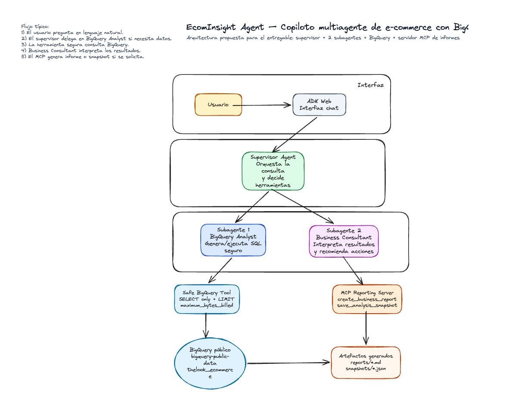

# Sistema multiagente con herramientas MCP y grounding con datos




## 1. Visión general

Construye un **sistema multiagente** funcional que combine las técnicas que
has practicado a lo largo del curso. Tu sistema debe orquestar al menos dos
sub‑agentes especializados bajo un supervisor, exponer al menos una
**herramienta MCP** y responder a preguntas fundamentadas en **tu propia
fuente de datos**: un índice **RAG** (FAISS local o Vertex AI Search) o un
conjunto de datos de **BigQuery**.

Deberás entregar:

1. El **código fuente** de tu solución.
2. Un **informe en PDF** que describa qué has construido, cómo funciona y
   cómo lo has probado.
3. Un **diagrama de arquitectura** incluido en el PDF.
4. **Capturas de conversaciones** con el agente que demuestren la solución
   de principio a fin.

El trabajo se apoya directamente en:

- `t04_multi_agent` y `t06_remote_a2a` — patrón supervisor / sub‑agente.
- `t05_mcp_agent` — exposición y consumo de herramientas MCP.
- `t09_local_rag_agent` y `t10_vertex_search_agent` — fundamentar el
  agente en un corpus documental.
- `t07_evaluations` (bonus opcional) — medir la calidad del agente.
- `t08_deploy_gcp` (bonus opcional) — desplegar el agente en GCP.

---

## 2. Objetivos de aprendizaje

Al completar este trabajo demostrarás que sabes:

- Descomponer una tarea del mundo real en un **supervisor + sub‑agentes
  especializados**.
- Diseñar e implementar un **servidor MCP propio** (o integrar uno
  existente) y consumirlo desde un agente ADK.
- Fundamentar un agente en **datos estructurados o no estructurados** mediante
  un pipeline de RAG o una herramienta de BigQuery.
- Diseñar **prompts y descripciones de herramientas** para que el
  supervisor escoja de forma fiable el sub‑agente / herramienta correcto.
- Razonar sobre los **modos de fallo**, **costes** y **limitaciones** de
  un sistema agéntico, y documentarlos.

---

## 3. Qué tienes que construir

### 3.1 Arquitectura obligatoria

Tu sistema **debe** incluir:

1. Un **agente supervisor** que reciba la consulta del usuario y decida
   qué sub‑agente o herramienta invocar.
2. **Al menos dos sub‑agentes especializados**, expuestos al supervisor
   como herramientas (`AgentTool` de `t04`) o como agentes A2A remotos
   (`t06`).
3. **Al menos una herramienta MCP** que *tú* diseñes y ejecutes como un
   proceso separado, expuesta por un servidor MCP (al estilo de `t05`).
   Debe hacer algo significativo para tu dominio (no vale el `notes_server`
   trivial del tutorial).
4. **Al menos una fuente de datos fundamentada** elegida de §3.2.
5. Un **punto de entrada de conversación** claro, ejecutable con un solo
   comando (por ejemplo `uv run adk web src/<tu_paquete>`), que el profesor
   pueda arrancar en menos de 5 minutos siguiendo tu README.

### 3.2 Fuente de datos — elige una (o combina dos para el bonus)

Debes fundamentar tu agente en **al menos una** de las siguientes opciones:

#### Opción A — RAG local (FAISS + LlamaIndex)

Al estilo de `t09_local_rag_agent`.

- Indexa uno o varios PDF / documentos de texto que elijas.
- Construye un índice FAISS en un notebook dentro de
  `assignment/notebooks/`.
- Expón la recuperación al agente mediante `LlamaIndexRetrieval` de ADK.

Buena opción para: corpus pequeños, demos sin conexión, sin coste de GCP.

#### Opción B — Vertex AI Search

Al estilo de `t10_vertex_search_agent`.

- Sube tus documentos a GCS e impórtalos en un data store de Vertex AI
  Search.
- Expón la recuperación al agente mediante `VertexAiSearchTool`.

Buena opción para: corpus más grandes, escalado gestionado y demostrar
habilidades en GCP.

#### Opción C — BigQuery

Usa BigQuery como fuente de datos estructurada (ningún tutorial cubre esto
de principio a fin, así que esta opción es más exigente).

- Elige (o crea) un dataset de BigQuery que encaje con tu escenario.
  Puedes usar un **dataset público** de
  <https://cloud.google.com/bigquery/public-data> (por ejemplo
  `bigquery-public-data.stackoverflow`,
  `bigquery-public-data.google_trends`,
  `bigquery-public-data.covid19_open_data`, etc.) o cargar tu propio CSV.
- Construye una o varias **function tools** o una **herramienta MCP** que:
  - Acepten una pregunta de alto nivel o una consulta parametrizada.
  - Ejecuten una consulta SQL **de solo lectura** (únicamente `SELECT`)
    contra BigQuery usando `google-cloud-bigquery`.
  - Devuelvan el resultado en un formato estructurado que el agente
    pueda resumir.
- Protégete frente a sentencias `INSERT` / `UPDATE` / `DELETE` / `DROP` /
  `TRUNCATE` (valida el SQL antes de ejecutarlo).
- Añade un **límite de filas** a cada consulta (por ejemplo `LIMIT 1000`)
  y un **máximo de bytes facturables** configurable (`maximum_bytes_billed`)
  para evitar costes descontrolados.

Referencias:

- [Cliente Python de BigQuery](https://cloud.google.com/python/docs/reference/bigquery/latest)
- [Datasets públicos de BigQuery](https://cloud.google.com/bigquery/public-data)
- [`maximum_bytes_billed`](https://cloud.google.com/bigquery/docs/reference/rest/v2/jobs#configuration.query.maximumBytesBilled)

### 3.3 Stack técnico

Tu solución **debe**:

- Usar **uv** para la gestión de dependencias.
- Usar el **Google ADK** para la capa de agentes (la misma librería de los
  tutoriales).
- Usar la configuración compartida `MODEL_PROVIDER` para que el profesor
  pueda ejecutar tu proyecto con Gemini, Groq o Vertex AI editando `.env`.
- Mantener todos los secretos fuera de git. Proporciona un
  **`.env.example`** con valores de ejemplo.

**Puedes** usar librerías adicionales (cliente de BigQuery, tu vector store
favorito, etc.) siempre que justifiques la elección en el informe.

---

## 4. Escenarios sugeridos

Tienes libertad para elegir tu propio dominio. Algunos escenarios que
pueden inspirarte:

- **Asistente universitario** — RAG sobre el material académico de tu
  universidad + herramienta MCP que reserve tutorías en una base de
  datos SQLite local.
- **Copiloto de DevOps** — RAG sobre un PDF de runbooks + herramienta MCP
  que lea métricas de un "almacén de métricas" en CSV/SQLite + sub‑agente
  que resuma incidencias.
- **Analista de e‑commerce** — BigQuery (dataset público
  `thelook_ecommerce`), más una herramienta MCP que cree un fichero de
  "informe" y un sub‑agente que redacte un resumen por correo.
- **Periodista de datos abiertos** — dataset público de BigQuery
  (COVID‑19, Google Trends, GitHub Archive…), más RAG sobre un pequeño
  conjunto de PDFs de noticias, más una herramienta MCP que exporte los
  hallazgos a Markdown.
- **Agente de atención al cliente** — RAG sobre manuales de producto +
  herramienta MCP que abra un "ticket" (escribiendo un JSON en disco) +
  sub‑agente que clasifique la severidad.
- **Asistente legal/fiscal** — RAG sobre un manual fiscal (como `t09`/
  `t10`) + herramienta MCP que rellene un formulario + sub‑agente que
  genere una checklist.

**No** tienes que usar uno de estos. Un dominio diferente es válido y
está bien visto, siempre que cumpla §3.1 y §3.2.

---

## 5. Bonus opcionales

Cada bonus suma crédito extra (ver §8). Puedes combinar varios.

- **Evaluaciones (`t07`)** — Construye un **golden dataset** pequeño (5+
  casos) y al menos tres métricas de DeepEval (`TaskCompletionMetric`,
  `ToolCorrectnessMetric` y una `GEval` personalizada). Intégralas en
  `pytest`.
- **Despliegue A2A (`t06`)** — Ejecuta cada sub‑agente como un servicio
  A2A remoto en lugar de usar `AgentTool`.
- **Despliegue en cloud (`t08`)** — Despliega el agente supervisor en
  Cloud Run o Vertex AI Agent Engine. Incluye la URL desplegada o el ID
  del engine en el informe (el docente no la llamará, solo comprobará la
  evidencia).
- **Observabilidad** — Añade logging estructurado o tracing de cada
  llamada a herramienta y cada llamada al LLM.
- **Dos fuentes fundamentadas** — Combina RAG **y** BigQuery en el mismo
  sistema. El supervisor debe escoger la fuente correcta para cada
  consulta.
- **CI/CD** — Añade un pipeline de CI/CD que automatice la compilación, 
  pruebas y despliegue de tu proyecto.

---

## 6. Entregables

### 6.1 Código

Entrega un enlace a un repositorio público de Git con esta estructura:

```text
<nombre-repositorio>/
├── README.md              # Cómo instalar y ejecutar tu proyecto
├── pyproject.toml         # Proyecto uv con tus dependencias
├── uv.lock
├── .env.example           # Todas las variables de entorno que el profesor debe rellenar
├── src/
│   └── <tu_paquete>/
│       ├── supervisor/    # Agente supervisor
│       ├── agents/        # Sub-agentes especializados
│       ├── mcp_server/    # Tu servidor de herramientas MCP
│       └── retrieval/     # Pegamento RAG / BigQuery (según §3.2)
├── notebooks/             # Notebook(s) de indexación si usas RAG
├── tests/                 # Opcional: tests pytest / suite DeepEval
└── report.pdf             # Ver §6.2
```

El README debe contener:

- Una descripción breve de lo que hace el proyecto.
- Los comandos exactos para instalarlo y ejecutarlo (`uv sync ...`,
  cómo arrancar el servidor MCP, cómo arrancar la UI del agente).
- Cualquier requisito previo (autenticación de gcloud, dataset de
  BigQuery, bucket de GCS…).

**En el caso de estar desplegado en cloud, añade el enlace a la URL del agente.**

### 6.2 Informe en PDF

Un documento de **6–12 páginas** que incluya:

1. **Portada** — título, nombres del grupo y fecha.
2. **Escenario** — qué problema resuelve tu sistema y para quién.
3. **Diagrama de arquitectura** — diagramas claro que muestre:
   - El supervisor y sus sub‑agentes.
   - El o los servidores MCP y sus herramientas.
   - La fuente de datos (almacén RAG, bucket de GCS, dataset de
     BigQuery, …).
   - Los modelos utilizados.
   - El flujo de datos para una consulta representativa.

   Puedes usar [draw.io](https://app.diagrams.net/),
   [Excalidraw](https://excalidraw.com/),
   [Mermaid](https://mermaid.js.org/) o cualquier otra herramienta.
   Expórtalo como PNG/SVG e inclúyelo en el PDF.
4. **Desglose de componentes** — una subsección breve por cada agente y
   cada herramienta: propósito, aspectos destacados del prompt, entradas
   / salidas, modos de fallo.
5. **Fuente de datos** — qué datos has indexado, por qué elegiste
   RAG / Vertex AI Search / BigQuery, tu estrategia de chunking / SQL y
   cualquier medida que hayas tomado para controlar coste o latencia.
6. **Capturas de conversaciones** — al menos **cuatro capturas** de
   conversaciones reales con tu agente en `adk web` (o tu UI propia),
   cada una precedida de **un párrafo** que explique qué muestra el
   ejemplo y por qué es interesante (por ejemplo: "el supervisor delega
   en el sub‑agente de BigQuery y después pide a la herramienta MCP que
   guarde el informe"). Al menos una captura debe mostrar un **caso de
   fallo** que el agente gestione con elegancia.
7. **Evaluación** — cómo has probado el sistema. Si has completado el
   bonus de evaluaciones, incluye las puntuaciones de las métricas; en
   caso contrario, describe los casos de prueba manuales y sus
   resultados.
8. **Limitaciones y trabajo futuro** — al menos tres limitaciones
   concretas (coste, latencia, alucinaciones en consultas fuera de
   alcance, prompt injection en las herramientas MCP…) y cómo abordarías
   cada una.

Entrega en el siguiente correo electrónico: <danielruizriquelme@gmail.com>
---
